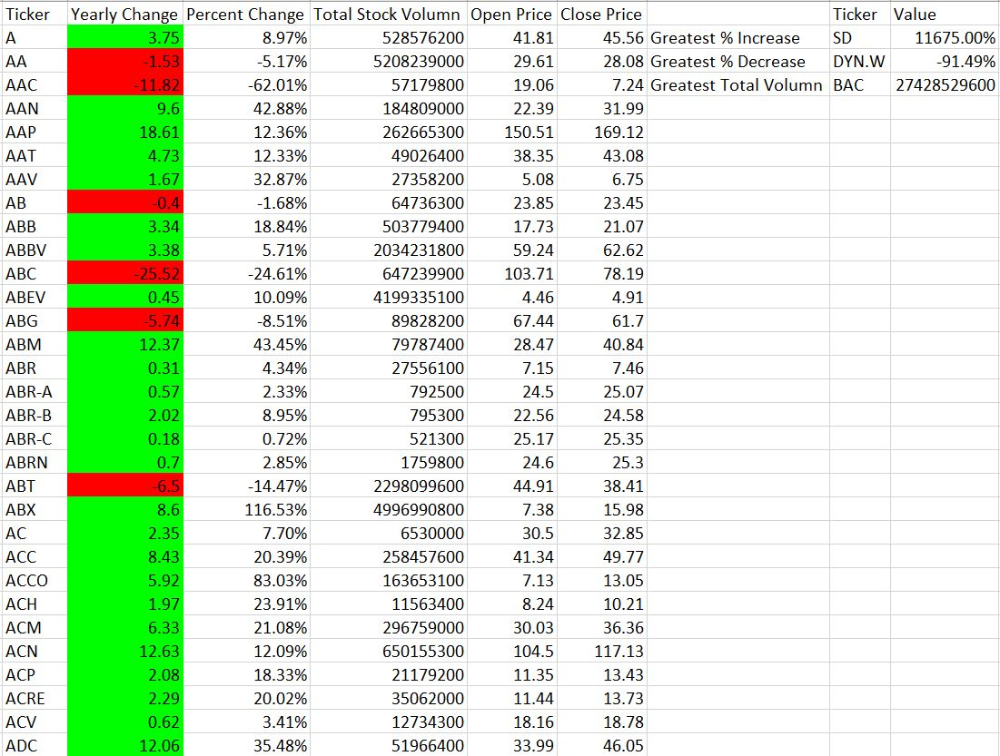
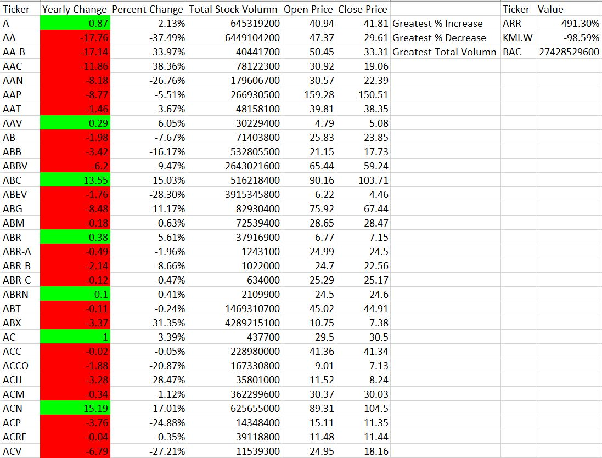
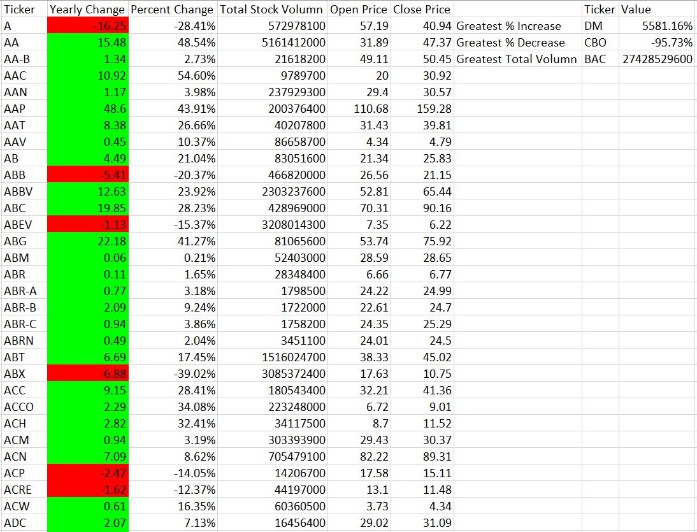

# VBA Stocks - The VBA of Wall Street

### About The Project 

* A VBA script that will loop through all the stocks for one year and output the following information.

  * The ticker symbol.

  * Yearly change from opening price at the beginning of a given year to the closing price at the end of that year.

  * The percent change from opening price at the beginning of a given year to the closing price at the end of that year.

  * The total stock volume of the stock.

  * Return the stock with the "Greasteest % increase", "Greastest % decrease" and "Greastest total volumn".

### Screenshot Of The VBA Result

* 2016 Screenshot

* 2015 Screenshot

* 2014 Screenshot
